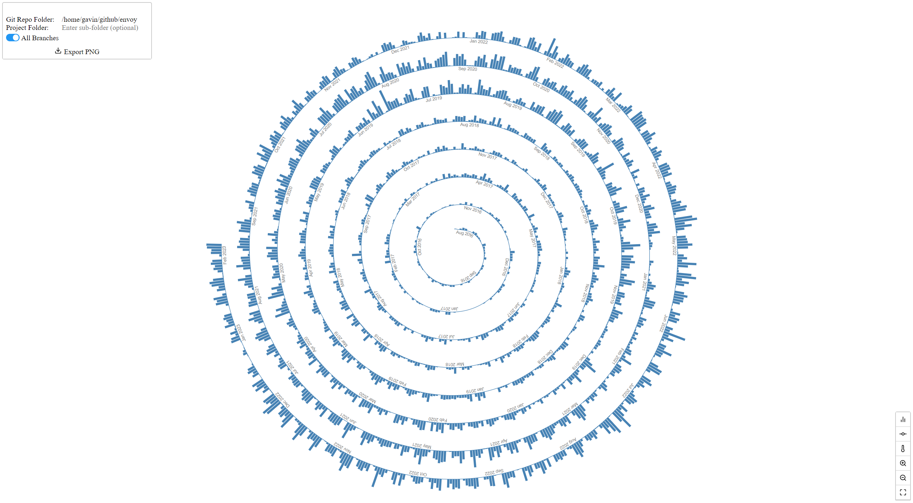

# GitSpiral

Draw the daily commits to a git repo as a spiral.

Inspired by: https://jokergoo.github.io/2022/02/03/spiral-visualization-of-daily-git-commits/

 

## Note

The git log is executed on the backend. Any paths and folders entered are relative to the backend not the client. 